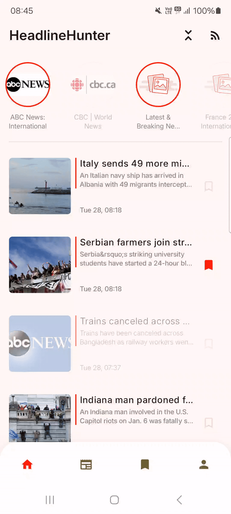

<h1 align="center">HeadlineHunter</h1>

A simple RSS reader app.

## Key Features:
- Home Screen

Browse all the latest news from your selected RSS feeds in one unified view.

- Unread Articles Screen

Keep track of what’s new by viewing only unread articles.

- Bookmark Screen

Save your favorite articles for later reading by adding them to your bookmarks.

- Settings Screen

Customize your experience with options to enable/disable notifications and switch between light and dark modes to suit your environment.

- Details Screen

Dive deep into the details of any article with a clean and distraction-free reader-friendly layout.

- Add New RSS Feed Screen

Expand your content library by subscribing to new RSS feed channels.

  
## Screenshots

  
## Demo

  
## Technologies and libraries used
- MVI
- Compose
- Kotlin
- Koin
- Room
- Coroutines
- Flow
- RssParser
- WorkManager
- Jetpack Navigation
